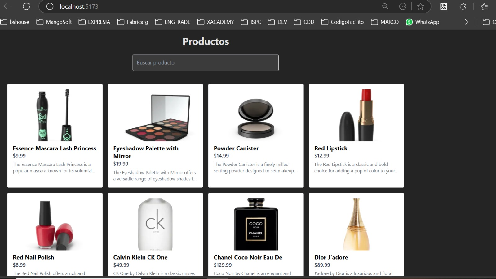
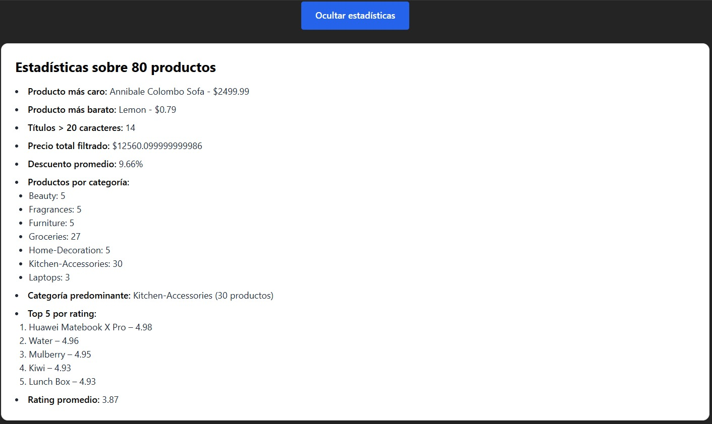

Proyecto React de Productos con Estadísticas
Descripción
Esta aplicación React consume una API pública para mostrar una lista de productos y estadísticas basadas en los productos filtrados por búsqueda. Está diseñada para demostrar manejo de datos dinámicos, componentes reutilizables, filtros y renderizado condicional.

Estadísticas agregadas
En la sección de estadísticas se calculan y muestran dinámicamente las siguientes métricas basadas en los productos filtrados:

Producto más caro (nombre y precio)

Producto más barato (nombre y precio)

Cantidad de productos con títulos mayores a 20 caracteres

Precio total acumulado de los productos filtrados

Promedio de descuento (discountPercentage)

Promedio de rating

Distribución de productos por categoría

Categoría predominante (con mayor cantidad de productos)

Top 5 productos por rating

División del código en componentes
El código se dividió en tres componentes principales para facilitar su mantenimiento y reutilización:

App: Componente principal que maneja el estado global, obtiene los datos de la API, controla la búsqueda y decide qué mostrar.

ProductList: Componente funcional encargado únicamente de mostrar la lista de productos recibida por props. Incluye animación al actualizar la lista.

StatsPanel: Componente funcional que recibe la lista de productos filtrados y calcula las estadísticas para mostrarlas de forma clara y ordenada.

Cada componente es independiente y recibe solo las props necesarias, sin mantener estado propio para asegurar un diseño limpio y modular.

Tecnologías usadas
React con Hooks (useState, useEffect)

Axios para consumo de API

Tailwind CSS para estilos y animaciones básicas, incluyendo la animación fadeIn en la lista de productos

Cómo usar
Clonar el repositorio.

Ejecutar npm install para instalar dependencias.

Ejecutar npm run dev (o npm start) para iniciar la aplicación.

Escribir en el campo de búsqueda para filtrar productos y ver las estadísticas actualizarse dinámicamente.

## Capturas de pantalla

### Lista de productos

### Panel de estadísticas

https://dolarapi.com/docs/argentina/operations/get-dolares.html