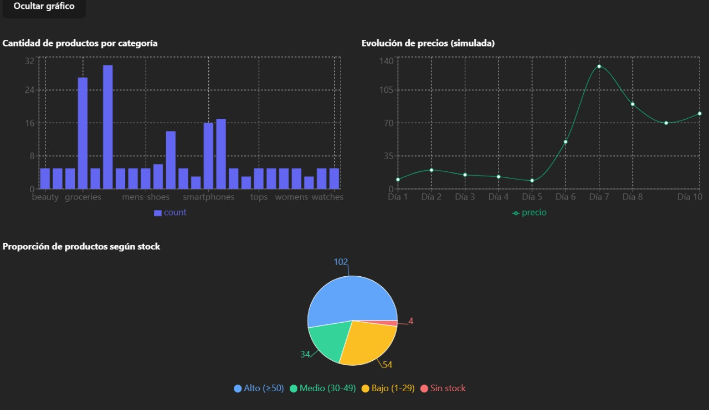

Proyecto React de Productos con Estadísticas

Descripción:
Esta aplicación React consume una API pública (https://dummyjson.com/) para mostrar una lista de productos y estadísticas basadas en los productos filtrados por búsqueda. Está diseñada para demostrar manejo de datos dinámicos, componentes reutilizables, filtros y renderizado condicional.
El componente principal App obtiene los datos de la API y maneja el estado global de la aplicación (productos, filtros, orden, búsqueda). Luego, pasa los productos filtrados y otras props relevantes a los componentes hijos para que rendericen la información y estadísticas correspondientes.

Estadísticas agregadas
En la sección de estadísticas se calculan y muestran dinámicamente las siguientes métricas basadas en los productos filtrados:

Producto más caro (nombre y precio)

Producto más barato (nombre y precio)

Cantidad de productos con títulos mayores a 20 caracteres

Precio total acumulado de los productos filtrados

Promedio de descuento (discountPercentage)

Promedio de rating

Distribución de productos por categoría

Categoría predominante (con mayor cantidad de productos)

Top 5 productos por rating

División del código en componentes
El código se dividió en seis componentes principales para facilitar su mantenimiento y reutilización:

App: Componente principal que maneja el estado global, obtiene los datos de la API, controla la búsqueda y decide qué mostrar.

ProductList: Componente funcional encargado únicamente de mostrar la lista de productos recibida por props. Incluye animación al actualizar la lista.

StatsPanel: Componente funcional que recibe la lista de productos filtrados y calcula las estadísticas para mostrarlas de forma clara y ordenada.

Filters: Componente encargado de generar la funcionalidad de buscar por texto y categorias. Tambien se encarga de ordenar por precio y rating ascendente y descendente. 

Charts : Componente funcional que recibe los productos filtrados y genera los graficos de torta, de barras y una simulacion de evolucion de precios en ejes cartesianos. 

Exports: Componente funcional que recibe los productos filtrados y exporta su data en distintos formatos a seleccionar: CSV, JSON y Excel. 

PriceInUSD: Componente funcional que convierte un precio en pesos argentinos (priceARS) a dólares usando una tasa de cambio (usdRate). Muestra el valor resultante en formato ($xx.xx USD) como un tooltip y se activa y desactiva utilizando un boton. Se utilizo la siguiente api externa: https://dolarapi.com/docs/argentina/operations/get-dolares.html

Cada componente es independiente y recibe solo las props necesarias, sin mantener estado propio para asegurar un diseño limpio y modular.

Tecnologías usadas
React con Hooks (useState, useEffect)
Recharts, libreria para construir graficos.
Axios para consumo de API
Tailwind CSS para estilos y animaciones básicas, incluyendo la animación fadeIn en la lista de productos

Cómo usar
Clonar el repositorio.

Ejecutar npm install para instalar dependencias.

Ejecutar npm run dev (o npm start) para iniciar la aplicación.

Escribir en el campo de búsqueda para filtrar productos y ver las estadísticas actualizarse dinámicamente.

### Lista de productos por modo claro

### Lista de productos por modo oscuro con tooltip de dolar activado

### Graficos de productos filtrados

### Estadisticas de productos filtrados

https://dolarapi.com/docs/argentina/operations/get-dolares.html